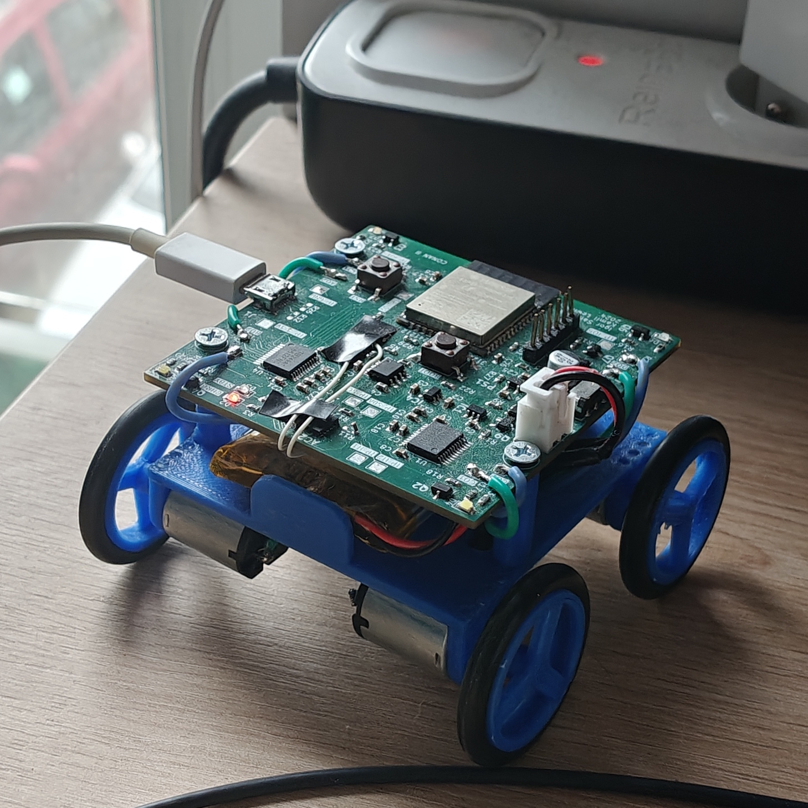

# Programmable Vehicle

The project focuses on building a small programmable vehicle capable of navigating a predefined route with high positional accuracy. The initial goal is to reach the target location with an arrival error on the order of a few centimeters, acknowledging that millimeter-level precision is beyond the current scope.

The system allows for free control mode and preprogrammed path execution mode. Communication with the vehicle is achieved via Bluetooth. The vehicle chassis is fully designed in CAD and manufactured on a 3D printer. The electronics are implemented on a custom PCB built around an ESP32 microcontroller, an H-bridge motor driver (TB6612FNG), a lithium-ion battery, and a charging system made with TP4056 and charging protection using DW01. For displacement measurement, an accelerometer ADXL345 is included in the hardware design, although it provides limited practical value due to drift and measurement noise; future revisions will incorporate a wheel encoder to achieve reliable odometry and improve navigation accuracy. During the testing and upgrade possibilities assessment, it became known that measuring the displacement with an accelerometer isn't the best idea and an encoder based system would probably work way better.

## Architecture

- MPU: ESP32-WROOM-32E-N16,
- H-bridge motor driver: TB6612FNG,
- Battery charger: TP4056,
- Overcharge protection: DW01,
- Accelerometer: ADXL345 - initially planned to be used for displacement measurement unit, but the plan failed due to drift and measurement noise,
- LDO: MIC5504-3.3YM5-TR.

## Project Structure

- `mini-car` - The vehicle electronics PCB design.
- `mini-car-brain` - The vehicle controll system written for ESP32.
- `programmable-vehicle-chasis` - The vehicle CAD design files.